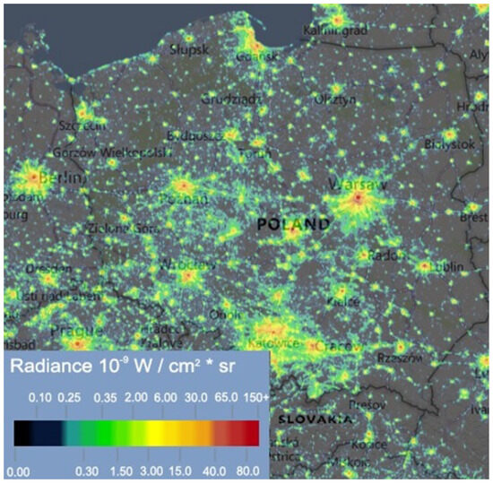
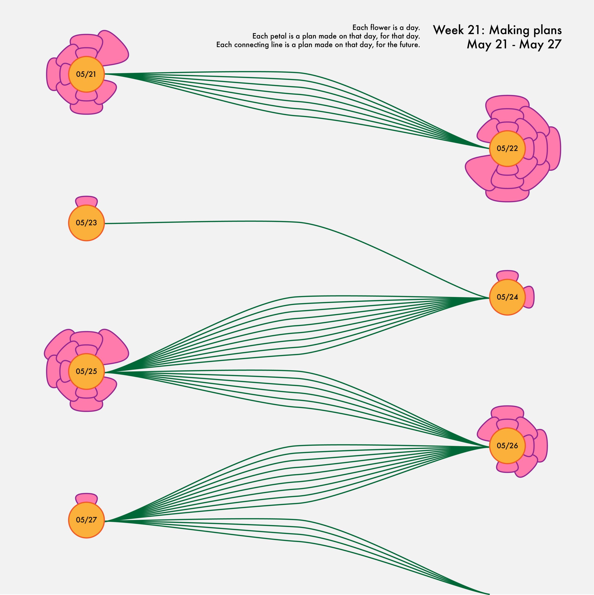
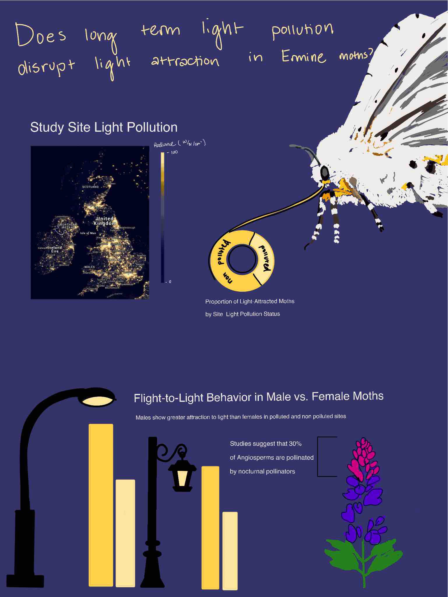

# Pre-planning

1.  Restate the questions you hope to answer with your infographic. This should include one overarching question (think of this as driving the overall theme of your infographic) and at least three subquestions (each of which will be addressed by your infographic’s component visualizations). Have these questions changed at all since FPM #1? If yes, how so?

Main question:

Do ermine moth populations have reduced light attraction when exposed to long-term urban light pollution?

Sub questions:

-   Where are the study sites used with the experimental populations?

-   How does overall attraction to light between experimental moth populations compare at sites categorized as light polluted vs. non-polluted?

-   Are there differences in light attraction evolution based on sex?

2.  Explain which variables from your data set(s) you will use to answer the above questions, and how.

latitude and longitude: mapping observational sites.

light pollution bin: compare across map sites to understand variation between sites.

number of moths not attracted and attracted in experiment: calculating general proportion of moths that were attracted to light across pollution category.

sex: plotting between sex differences in light attraction.

3.  In FPM #2, you created some exploratory data viz to better understand your data. You may already have some ideas of how you plan to formally visualize your data, but it’s incredibly helpful to look at visualizations by other creators for inspiration. Find at least two data visualizations that you could (potentially) borrow / adapt pieces from. Download and embed them into your drafting-viz.qmd file, and explain which elements you might borrow (e.g. the graphic form, legend design, layout, etc.).

4.   Light pollution in Poland in 2021 presented as radiance (source: https://www.lightpollutionmap.info, accessed on 22 February 2022).

I like the dark theme of this visual. I'd like to potentially find a light pollution raster dataset to use to compare to the experimentally measured values in the study data I am using because as of right now they are just points on a map, and I am having a hard time getting a basemap that has a dark theme with clear labels because my data is in a relatively rural area.

2.   (source: nightingaledvs.com/plan-planet-part-6-of-a-year-long-personal-data-project/, accessed on 22 February 2022)

This is a really nice use of an alluvial diagram. I don't love how traditional ones are typically very dense, so I'm considering making a more arty style one in my final viz to represent nocturnal pollinator loss or proportion of pollination that happens at night in some way.

# Drawn visualizations



# Drafting Viz

```{r}
# Load necessary libraries
library(tidyverse)
library(here)
library(janitor)
library(sf)
library(ggspatial)
library(prettymapr)
library(showtext)

# Add desired fonts
font_add_google(name = "Noto Sans", family = "noto_sans")
font_add_google("Libre Baskerville", family = "libre")
```

```{r}
#| output: FALSE

# Load in data and standardize column names
light_pol <- read.delim(here("data", "light_pol.txt"), skip = 2) %>%
  clean_names() %>%
  # Separate location column
  separate_wider_delim(
    cols = location_country,
    delim = "/",
    names = c("loc_name", "country")
  ) %>%
  # Remove any white space from separated columns
  mutate(country = str_squish(country), loc_name = str_squish(loc_name)) %>%
  # Rename population column to be more relevant
  rename(pollution_status = population) %>%
  # Recode values to be more intuitive
  mutate(
    pollution_status = recode(
      pollution_status,
      "dark-sky" = "non polluted",
      "light-polluted" = "polluted"
    ),
    # Recode country codes to full names
    country = recode(country, "F" = "France", "CH" = "Switzerland"),
    # Fix location name with conversion error
    loc_name = recode(loc_name, "Kleinl�tzel" = "Kleinlützel")
  ) %>%
  # Make a new column with pollution bin values
  mutate(
    pollution_bin = case_when(
      loc_name == "Blochmont"       ~ "0.25–0.4",
      loc_name == "Kleinlützel"     ~ "0.4-1",
      loc_name == "Kiffis"          ~ "0.4-1",
      loc_name == "Doucier"         ~ "0.4-1",
      loc_name == "Lutterbach"      ~ "1-3",
      loc_name == "Allschwil"       ~ "20-40",
      loc_name == "Reinach"         ~ "20-40",
      loc_name == "Hegenheim"       ~ ">40",
      loc_name == "Basel Kannenfeld" ~ ">40",
      loc_name == "Basel Spalentor" ~ ">40"
    ),
    # New Latitude and Longitude column with values from paper
    lat = case_when(
      loc_name == "Blochmont"        ~ 47 + 26 / 60 + 16 / 3600,
      loc_name == "Kleinlützel"      ~ 47 + 25 / 60 + 55 / 3600,
      loc_name == "Kiffis"           ~ 47 + 26 / 60 + 18 / 3600,
      loc_name == "Doucier"          ~ 46 + 39 / 60 + 40 / 3600,
      loc_name == "Lutterbach"       ~ 47 + 46 / 60 + 12 / 3600,
      loc_name == "Allschwil"        ~ 47 + 32 / 60 + 52 / 3600,
      loc_name == "Reinach"          ~ 47 + 31 / 60 + 50 / 3600,
      loc_name == "Hegenheim"        ~ 47 + 33 / 60 + 43 / 3600,
      loc_name == "Basel Kannenfeld" ~ 47 + 33 / 60 + 59 / 3600,
      loc_name == "Basel Spalentor"  ~ 47 + 33 / 60 + 28 / 3600
    ),
    lon = case_when(
      loc_name == "Blochmont"        ~  7 + 14 / 60 + 10 / 3600,
      loc_name == "Kleinlützel"      ~  7 + 22 / 60 + 57 / 3600,
      loc_name == "Kiffis"           ~  7 + 17 / 60 + 59 / 3600,
      loc_name == "Doucier"          ~  5 + 41 / 60 + 21 / 3600,
      loc_name == "Lutterbach"       ~  7 +  3 / 60 + 36 / 3600,
      loc_name == "Allschwil"        ~  7 + 32 / 60 +  8 / 3600,
      loc_name == "Reinach"          ~  7 + 36 / 60 + 25 / 3600,
      loc_name == "Hegenheim"        ~  7 + 31 / 60 + 14 / 3600,
      loc_name == "Basel Kannenfeld" ~  7 + 34 / 60 + 19 / 3600,
      loc_name == "Basel Spalentor"  ~  7 + 34 / 60 + 53 / 3600)) %>% 
  mutate(pollution_bin = factor(pollution_bin, levels = c("0.25–0.4", 
                                                           "0.4-1", 
                                                           "1-3", 
                                                           "20-40", 
                                                           ">40")
                                 )
         )

# Create sf object for mapping
light_pol_sf <- st_as_sf(light_pol, coords = c("lon", "lat"), crs = 4326)

```


```{r}
#| warning: false
#| out-width: "100%"
#| fig.asp: 1

# Enable font interp
showtext_auto(enable = TRUE)

# Create map
map <- ggplot(light_pol_sf) +
  # Use OpenStreetMap basemap
  annotation_map_tile(type = "cartodark", zoomin = 0) +
  # Fill points by radiance measured
  geom_sf(
    aes(fill = pollution_bin),
    color = "white",
    size = 6,
    shape = 21
  ) +
  # Create custom radiance color scale
  scale_fill_manual(values = c("#893533", "#AE4716", "#F6A905", "#FFF533", "#FFFCC2")) +
  # Add labels
  labs(title = "Light Pollution at Sample Sites on the France-Switzerland Border",
       subtitle = "Greater Light Pollution at Swiss City Sites",
       caption = "Data: Altermatt, Florian; Ebert, Dieter (2016),\n Reduced flight-to-light behaviour of moth populations exposed to long-term urban light pollution,\n Biology Letters, Article-journal, https://doi.org/10.1098/rsbl.2016.0111") +
  theme_light() +
  # Add legend title
  guides(fill = guide_legend(
    # Legend title
    title = "Radiance\n(10–9 W sr–1 cm–2)"
  )) +
  # Create custom theme
  theme(
    plot.background = element_rect(fill = "#242842"), 
    panel.background = element_rect(fill = "#242842"), 
    legend.background = element_rect(fill = "#242842"), 
    
    # Align with y axis text instead of just axis
    plot.title.position = "plot",
    
    # Edit title format
    plot.title = element_text(
      face = "bold",
      family = "libre",
      size = 27,
      lineheight = 1.5, 
      color = "white"),
    
    # Subtitle format
    plot.subtitle = element_text(
      family = "noto_sans",
      size = 20,
      margin = margin(b = 8), 
      color = "lightgrey"),
    
    # Axis labels
    axis.text = element_text(size = 15,
      family = "noto_sans", 
      color = "lightgrey"),

    # Caption format
    plot.caption = element_text(
      family = "noto_sans",
      face = "italic",
      size = 15, color = "lightgrey"), 
    
    # Legend text and title format
    legend.text = element_text(size = 15,
      family = "noto_sans", color = "lightgrey"), 
    
    legend.title = element_text(size = 18,
      family = "noto_sans", color = "lightgrey")
    )
    

# Figure out how to fix alpha somehow


```

```{r}
# Save map for class
ggsave("draft_map.png", device = "png", path = "figures/", plot = map, dpi = 600 )
```

## Drafting initial ideas

ideas - donut plot somehow - proportion of moths attracted to light in polluted vs non polluted areas - comparison of trends in male vs female moths to show any weird evolutionary trends between sexes

Implement other data? - show increases in light pollution over the last 10 years in Europe - display some visual for the importance of nocturnal pollinators

I want to find the proportion of moths that are attracted to light in "polluted" vs. "non-polluted" areas.

```{r}
#| out-width: "100%"
#| fig.asp: 1

# Enable formatting
showtext_auto(enable = TRUE)

# Create pollution summary by status and sex- with proportion for attraction
pol_sum <- light_pol %>%
  group_by(pollution_status, sex) %>%
  summarise(
    total_attracted     = sum(moths_attracted),
    total_not_attracted = sum(moths_not_attracted),
    prop_attracted      = total_attracted / (total_attracted + total_not_attracted)
  ) %>%
  # Add better labels for sex
  mutate(pollution_status = factor(pollution_status, levels = c("polluted", "non polluted")),
         sex = recode(sex, 
                      "m" = "Male", 
                      "f" = "Female")) 

# Bar plot
bar_plot <- ggplot(pol_sum, aes(x = pollution_status, y = prop_attracted, fill = sex)) +
  # Put sex columns next to each other instead of stacking
  geom_col(position = "dodge") +
  # Fill labels to look like light beams
  scale_fill_manual(values = c("#FFFCC2", "#FFF533")) +
  scale_y_continuous(labels = scales::percent)+
  # Add labels
  labs(title = "Flight-to-Light Behavior in Ermine Moths", 
       subtitle = "Moths in light polluted areas show reduced attraction to light", 
       caption = "Data: Altermatt & Dieter (2016)", 
       y = "Proportion of moths attracted to light")+
  theme_minimal() +
  # Apply custom theme
    theme(
      # Move legend to the bottom of the plot
      legend.position = "bottom", 
      
      # Remove axis title because it's redundant
      axis.title.x = element_blank(), 
      
      # Background colors
      plot.background = element_rect(fill = "#242842"),
      panel.background = element_rect(fill = "#242842"),
      legend.background = element_rect(fill = "#242842"),
      
      # Align with y axis text instead of just axis
      plot.title.position = "plot",
      
      # Title
      plot.title = element_text(
        face = "bold",
        family = "libre",
        # Size relative to base size in theme
        size = 27,
        lineheight = 1.5,
        color = "white"
      ),
      
      # Subtitle
      plot.subtitle = element_text(
        family = "noto_sans",
        size = 20,
        margin = margin(b = 8),
        color = "lightgrey"
      ),
      
      # Axis titles
      axis.title = element_text(
        size = 15,
        family = "noto_sans",
        color = "lightgrey"
      ), 
      
      # Axis labels
      axis.text = element_text(
        size = 15,
        family = "noto_sans",
        color = "lightgrey"
      ),
      
      # Caption
      plot.caption = element_text(
        family = "noto_sans",
        face = "italic",
        size = 15,
        color = "lightgrey"
      ),
      
      # Legend
      legend.text = element_text(
        size = 15,
        family = "noto_sans",
        color = "lightgrey"
      ),
      legend.title = element_blank()
      )

ggsave("bar_plot.pdf", device = "pdf", path = "figures/", plot = bar_plot, dpi = 600 )
```

```{r}
# Create dataframe for overall summary proportions
pol_tot_sum <- light_pol %>%
  group_by(pollution_status) %>%
  summarise(
    total_attracted     = sum(moths_attracted),
    total_not_attracted = sum(moths_not_attracted),
    prop_attracted      = total_attracted / (total_attracted + total_not_attracted)
  ) 

```

```{r}
#| out-width: "100%"
#| fig.asp: 1

showtext_auto(enable = TRUE)

# Create donut plot
ggplot(pol_tot_sum, aes(x = 2, y = prop_attracted, fill = pollution_status)) +
  geom_col(width = 1, color = "white") +
  # Make a donut
  coord_polar(theta = "y") +
  # Hole size
  xlim(0.01, 3) +
  
  # Remove all ticks and legend
  theme_void()+
  
  # Add custom colors
  scale_fill_manual(values = c("#FFF533", "#FFFCC2")) +
  
  # Add labels
  labs(title = "Long-Term Urban Light Pollution Effect on Ermine Moths")+
  
  # Add theme
    theme(
      plot.background = element_rect(fill = "#242842"),
      panel.background = element_rect(fill = "#242842"),
      legend.background = element_rect(fill = "#242842"),
      
      # Align with y axis text instead of just axis
      plot.title.position = "plot",
      
      # Title
      plot.title = element_text(
        face = "bold",
        family = "libre",
        # Size relative to base size in theme
        size = 27,
        lineheight = 1.5,
        color = "white"
      ),
      
      # Subtitle
      plot.subtitle = element_text(
        family = "noto_sans",
        size = 20,
        margin = margin(b = 8),
        color = "lightgrey"
      ),
    
      # Legend
      legend.text = element_text(
        size = 15,
        family = "noto_sans",
        color = "lightgrey"
      ),
      
      legend.title = element_blank()
      )


ggsave(here("figures", "donut_plot.pdf"), 
                       device = "pdf", 
                       width = 8,
                       height = 7, 
                       units = "in", 
                       dpi = 300)
```

1.  What are the key insights you want your infographic to communicate, and how will your design choices help highlight and support those messages?

The paper I found exploring this topic found significant effect of long term light pollution on light attraction behavior in the moth populations they studied, so I want to primarily communicate the difference, including that there is a significant difference in behaviors between male and female moths. I think my use of a bar plot demonstrates the significantly larger attraction in male moths to light overall and the decrease in light polluted areas. I want to use visual elements in my final infographic that make the differences even clearer. Particularly in this element, I plan to split the results with a larger more industrial looking street lamp graphic and a more neighborhood looking one to project the bars as light beams, which I think will highlight the trend.

2.  What challenges did you encounter or anticipate encountering as you continue to build / iterate on your visualizations in R? If you struggled with mocking up any of your three visualizations, describe those challenges here.

I switched my dataset from the last FPM, and I am happier with this dataset, however, the data provided by the authors of this paper did not include spatial data or light pollution bins initially- so I had to build these into the data from their paper. I also struggled to find a basemap for the sample sites. I think it's definitely worth visualizing the spatial distribution of the sites because it informs we might think of the sample sites, but it was hard to figure out an appropriate zoom on the map and a basemap that highlights the pollution bins while still making clear where they are in the world- particularly for American readers.

3.  What ggplot extension tools / packages do you need to use to build your visualizations? Are there any that we haven’t covered in class that you’ll be learning how to use for your visualizations?

I used the {ggspatial} and {prettymapr} packages for my basemap and learned a bit more about basemap use in ggplot because we are used to working with {tmap}. I am frankly still considering using {tmap} rather than ggplot because I think it might be worth finding rasterized light pollution data.

4.  What feedback do you need from the instructional team and / or your peers to ensure that your intended message and key insights are clear?

I would like some feedback on if these graphic forms are communicating the overall difference in pollution exposure populations, or if I should use different plots to achieve this instead. Further, if Annie has any feedback on basemaps and using tmap vs. ggplot that would be super helpful!
